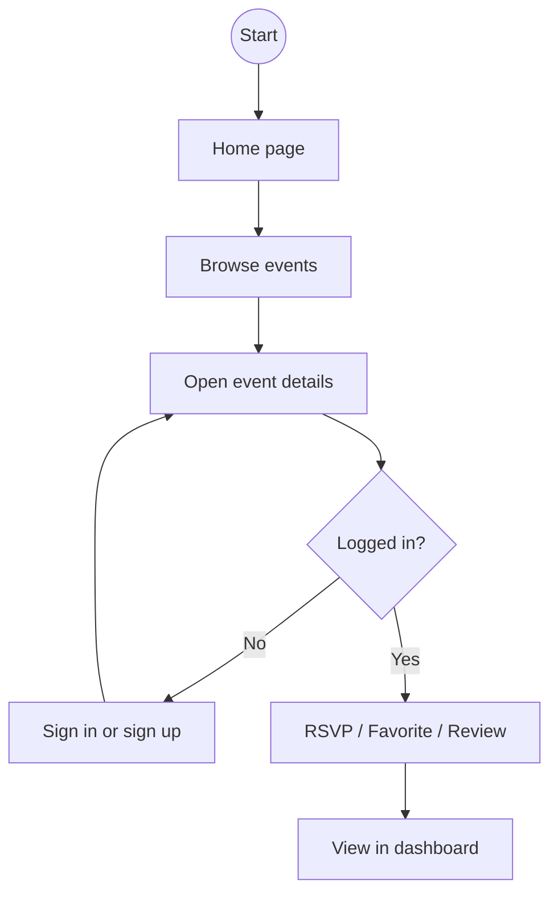
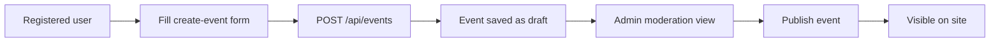
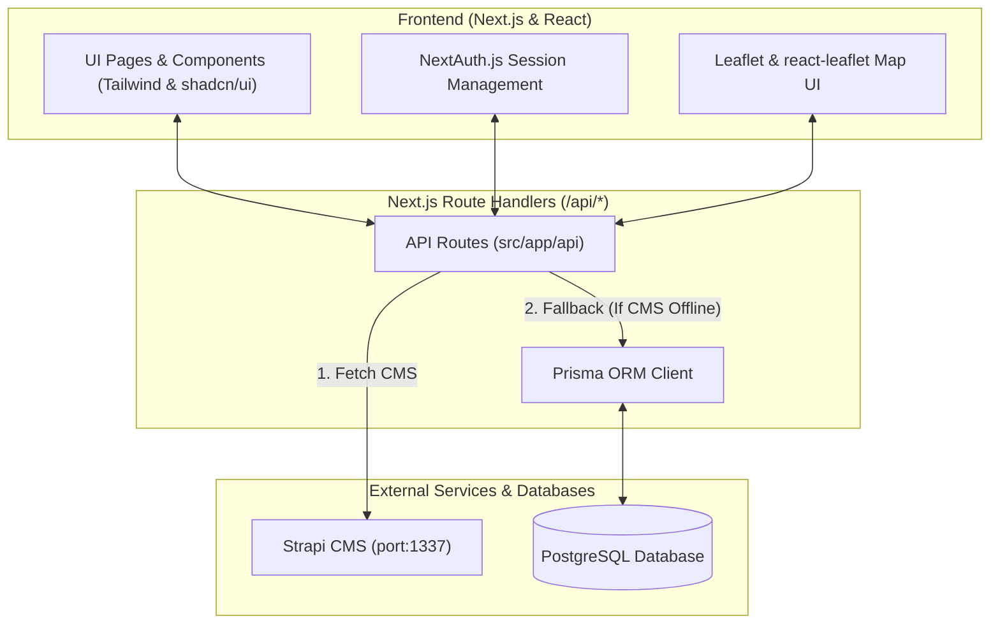
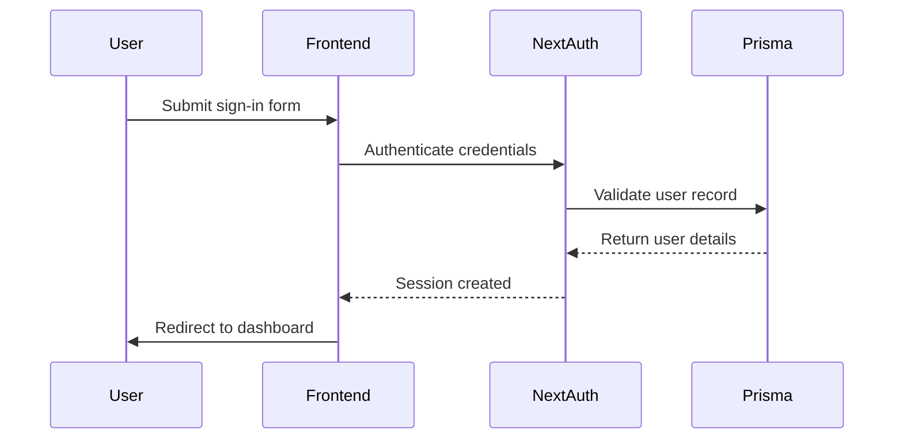

# Project Flowcharts

This document summarizes the current workflows of the event platform and its repository layout.

## 1. User journey flow

## 2. Event submission flow

## 3. Current system architecture

## 4. Authentication flow

